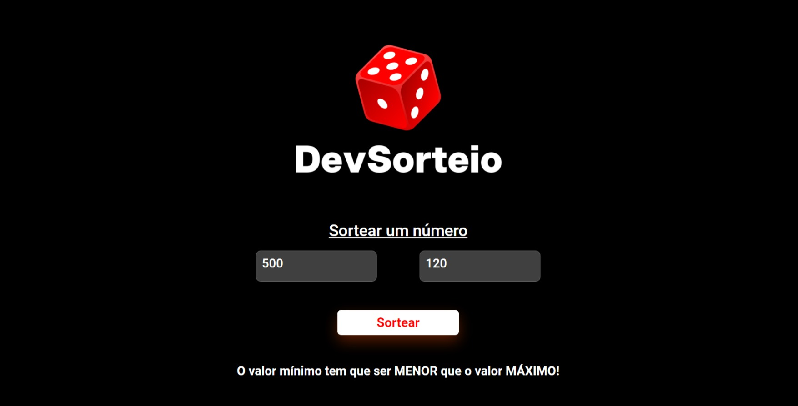

<h1>Projeto Random</h1>
<h2>Sorteador de Números</h2>
 
<h2>Tecnologias utilizadas:</h2>
 
<ul>
  <li>HTML</li>
  <li>CSS</li>
  <li>JAVASCRIPT</li>
</ul>
<h2>O que é o projeto Random e como funciona:</h2>
 

Projeto Random - Sorteador de Números foi desenvolvido para aprimorar os aprendizados em JavaScript, utilizando o métado Math.

O Math é uma ferramenta que nos dá o poder de obter variados resultados dentro de um parâmetro definido.

 

É possível adicionar quaisquer valores e clicando no botão "Sortear", será obtido um número entre os valores definidos.

Porém não é possível sortear um número sendo o primeiro maior (valor mínimo) que o segundo (valor máximo).

<h3>Exemplo:</h3>

